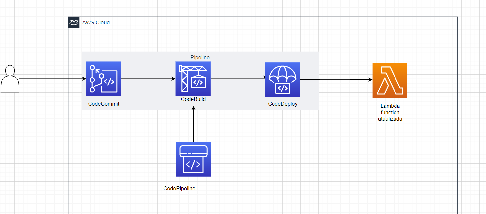
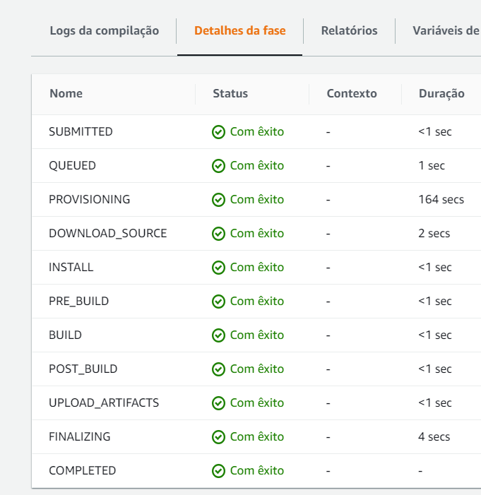

# awsCodePipeline




https://www.youtube.com/watch?v=uRdCN7F4IEA

# link: projeto funcionando

# Documentação Projeto da disciplina de Cloud – AWS Terraform

Este projeto consiste em criar uma infraestrutura capaz de provisionar o serviço de CodePipeline da AWS. 
A seguir veremos a finalidade deste serviço e como ele funciona.

Finalidade: O objetivo deste projeto é criar uma infraestrutura necessária para que uma aplicação possa ser atualizada de forma automática sempre que houver uma nova versão de implementação desenvolvida pela equipe. Dessa forma, a equipe de desenvolvimento não precisará se preocupar em subir a nova versão da aplicação, pois o CodePipeline CI/CD já cuida desse processo de forma automatizada sempre que necessário.

# Diagrama imagem:

De acordo com o diagrama podemos observar que o CodePipeline é composto por outros serviços também nativos da AWS. Sendo eles o CodeCommit, CodeBuild, CodeDeploy, S3 e Lambda. 
A seguir irei explicar sobre cada um destes serviços de maneira individual e explicar como cada serviço está integrado para constituir o CodePipeline.

# AWS S3

AWS S3 para manter quaisquer artefatos resultantes de um estágio de construção bem-sucedido, para uso posterior e posteridade.

## Observação

É importante nome o s3 com um nome exclusivo.

```
# ----- S31 -----
# Criação do bucket do S3 para o CodePipeline
resource "aws_s3_bucket" "pipeline_bucket" {
  bucket        = "my-pipeline-bucketykaro-876035787"
}

```

# Lambda

O AWS Lambda é um serviço sem servidor que permite que você execute código sem se preocupar com a infraestrutura subjacente. Ele oferece escalabilidade automática, baixa latência de inicialização e integração com outros serviços da AWS, tornando-o uma escolha popular para criar aplicativos e serviços altamente flexíveis, eficientes e dimensionáveis.

# CodeCommit

AWS CodeCommit atua como um servidor git, fornecendo repositórios para armazenar código e permite a interação com seu código por meio do git cli;

# CodeBuild

O AWS CodeBuild atua como um ambiente/mecanismo de compilação e é usado para executar instruções em vários estágios, para criar e empacotar código na forma de um artefato utilizável;

# CodeDeploy

O AWS CodeDeploy é um serviço que automatiza a implantação de aplicativos em ambientes de servidores e serviços gerenciados da AWS. Ele ajuda a simplificar o processo de implantação, permitindo que você entregue seus aplicativos de forma confiável, rápida e consistente.

# CodePipeline

AWS CodePipeline é a estrutura de CI/CD que vincula os outros três serviços (assim como outros) por meio de Estágios executáveis.

O AWS CodePipeline é um serviço de entrega contínua e integração contínua (CI/CD) fornecido pela Amazon Web Services (AWS). CI/CD refere-se a um conjunto de práticas e ferramentas usadas para automatizar e agilizar o processo de desenvolvimento de software, desde a integração de código até a entrega e implantação em produção.

O CodePipeline permite criar pipelines de entrega contínua para suas aplicações e serviços. Um pipeline consiste em uma série de etapas (stages) que representam as diferentes fases do processo de entrega de software, como a obtenção do código-fonte, compilação, teste, implantação e assim por diante.

Cada etapa do pipeline pode ser configurada para realizar ações específicas, como executar um teste automatizado, compilar o código-fonte, criar uma imagem de contêiner, implantar a aplicação em um ambiente de teste ou produção, entre outras tarefas relacionadas à entrega do software.

O CodePipeline oferece integração com outros serviços da AWS e ferramentas de terceiros, permitindo que você construa pipelines personalizados e flexíveis de acordo com suas necessidades. Além disso, ele fornece recursos de monitoramento e rastreamento para acompanhar o progresso do pipeline, notificações por e-mail e integração com serviços de gerenciamento de versão, como o AWS CodeCommit e o GitHub.

O AWS CodePipeline é uma ferramenta de CI/CD que permite automatizar e gerenciar o fluxo de trabalho de entrega contínua para seus aplicativos, facilitando a implementação rápida e confiável de novas versões de software.


Pré-requisitos
Para que você consiga provisionar este serviço é necessário que você tenha em sua máquina os seguintes pré-requisitos:

- Terraform; 
https://developer.hashicorp.com/terraform/tutorials/aws-get-started/install-cli

- Python/3.8;	
https://www.python.org/downloads/

- Conta AWS com usuário IAM com permissão de administrador;
Criar conta AWS: https://aws.amazon.com/
ID de chave de acesso: https://docs.aws.amazon.com/pt_br/powershell/latest/userguide/pstools-appendix-sign-up.html

- AWS CLI install ;
https://docs.aws.amazon.com/cli/latest/userguide/getting-started-install.html

- Conta no Github e Token de autorização com permissão de criação e atualização de repositórios;
https://github.com/ 

Ferramentas utilizadas na construção da infraestrutura:

Terraform é uma ferramenta de infraestrutura como código que permite definir e gerenciar recursos de infraestrutura de maneira declarativa, facilitando a implantação e o gerenciamento da infraestrutura em diferentes provedores de nuvem.

Python é usado em várias áreas, desde desenvolvimento web e científico até automação de tarefas e inteligência artificial. Sua combinação de simplicidade, versatilidade e poder tornou-a uma das linguagens de programação mais populares e amplamente adotadas em todo o mundo.

AWS, ou Amazon Web Services, é uma plataforma de serviços em nuvem fornecida pela Amazon. É uma das principais provedoras de serviços de computação em nuvem do mundo, oferecendo uma ampla gama de serviços que abrangem computação, armazenamento, banco de dados, análise, inteligência artificial, Internet das Coisas (IoT), segurança e muito mais.

Os serviços da AWS são projetados para ajudar indivíduos e organizações a construir e executar aplicativos e serviços de forma escalável, segura e confiável. Eles permitem que você provisione recursos de TI conforme necessário, pagando apenas pelo que utiliza, sem a necessidade de investir em hardware físico ou infraestrutura de data center.

•	requisito: git ≥ 1.7.9
Para saber a versão do seu git basta dar o seguinte comando em seu prompt.

'''
➜ git --version 

git versão <versão atual>
'''


 

Todo o código terraform para provisionar a infraestrutura está no arquivo main.tf.
Na pasta python temos código da função lambda (não esqueça de zipar este arquivo) e na pasta modules temos o arquivo buildspec.yml que será utilizado na etapa de build do codepipeline.

# Para rodar o projeto clone este repositório:
https://github.com/ykarodeandrade/awsCodePipeline

### Ao clonar coloque suas credenciais no no inicio do codigo da main em provide aws ou set suas credenciais na inicialização do terraform

Abra o terminal powershell no caminho no qual seu repositório está guardado;

Execute os seguintes comandos:

```
terraform init

```

-> set suas credenciais da AWS via terminal ou no inicio da main.tf em provider

```
terraform init
terraform plan
terraform apply
```


### ATENÇÃO 
Ao final de todo o projeto não esqueça de executar 
```
terraform destroy
```


## Explicando agora o contexto do projeto de maneira aplicada.  

# Codepipeline em questão é constituído primeiramente da etapa do CodeCommit.


# CodeCommit:
Nesta etapa iremos criar um repositório AWS semelhante ao github, porém neste caso de forma automática. 

``` 
# Criação do repositório do CodeCommit
resource "aws_codecommit_repository" "my_repo" {
  repository_name = "my-repositorio1"
  default_branch  = "master"
}
```

## Atenção

Ao rodar a infraestrutura é necessário clonar o repositório criado no codecommit em sua máquina. Pois inicialmente o repositório estará vazio. 

Para isso vá na sua conta da AWS e pesquise no console por *CodePipeline* .


Lá foi criado um repositório chamado  *my-repo* .

Copie o link https gerado e clone normalmente em sua máquina.


Será requisitado em sua máquina sua conta e senha da AWS para que sejam sincronizadas suas alterações ao repositório.

## Se você não configurou sua máquina com codecommit da AWS, a seguinte solicitação irá aparecer quando você for dar git push:


# Para achar essa informação devemos ir no console em Credenciais de segurança que está em IAM>usuario>(seu user):

## Procure por: *Credenciais HTTPS do Git para o AWS CodeCommit* 


# Cole suas credenciais onde foram solicitadas e seu commit irá funcionar


# Importante

## Mesmo clonanando o repositório e necessário que seja feito um commit a partir da sua máquina, se não a etapa de CodeCommit do CodePipeline não vai funcionar !


Agora vamos subir um codigo via codecommit;
### Você pode coloacar um código simples em python para que seja criado a branch master, que é a branch padrão.
Através do repositório my-repositoy1 suba um codigo python, por exemplo;

``` 
def lambda_handler(event, context):
    print("Codecommit funcionou!")

    return {
        'statusCode': 200,
    }

```

## Vemos que uma nova branch foi criada apos git push:


## E ao atualizarmos o console no CodePipeline podemos obervar que o commit teve êxito:


# Primeira etapa do CodePipeline funciona!

## A próxima etapa do CodePipeline é a etapa do CodeBuild

Podemos pesquisar no console da AWS por CodeBuild e veremos que o serviço foi criado e se chama *my-project* .

# O CodeBuild inicia automaticamnente após a etapa do CodeCommit.


# Aguarde um pouco





# Codedeploy

## Após a etapa de buil o deploy começa a carregar automaticamente


# CodePipeline completo


# ################################

# Observação:

## A depender das configurações da sua conta AWS a etapa build pode falhar, tente rodar em outra conta.


Ao pesquisar pelo erro tive obtive a seguinte informação que pode ser a causa da não conclusão desta etapa no CodePipeline:


# Agradecimentos especiais aos professores Rodolfo Avelino e Tiago Demay pelos ensinamentos compartilhados.
